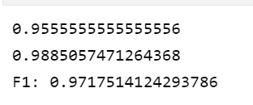
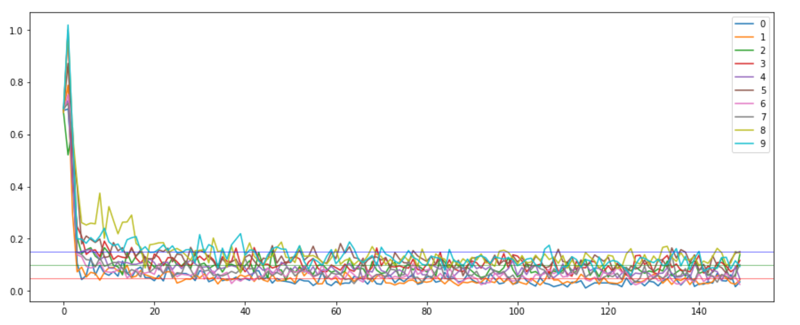
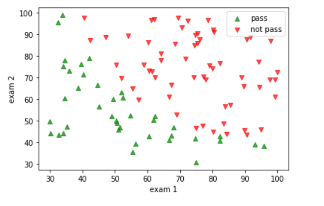
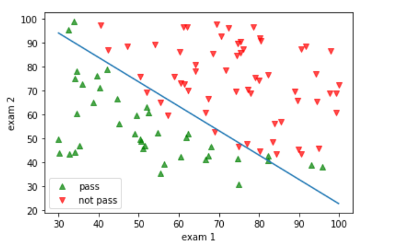
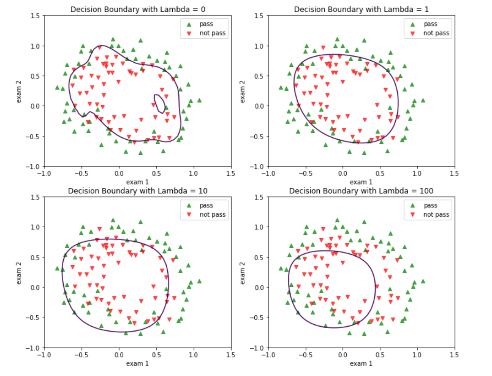

[TOC]

|  姓名  |               完成任务情况               |
| :----: | :--------------------------------------: |
| 仇誓博 | 损失函数、训练函数、二分类优化、md文档编写 |
|  陈昊  |                                          |
|  李婕  |                                          |
| 董轩言 |                                          |
|        |                                          |

 

## MNIST-classifier

### 二分类

#### 数据展示

#### 二分类后

#### 优化前

#### 优化中

#### 优化后

#### 结果

### 多分类结果展示

## optimize_minimize

#### 数据展示

#### 直线边界划分展示

#### 曲线边界划分展示

